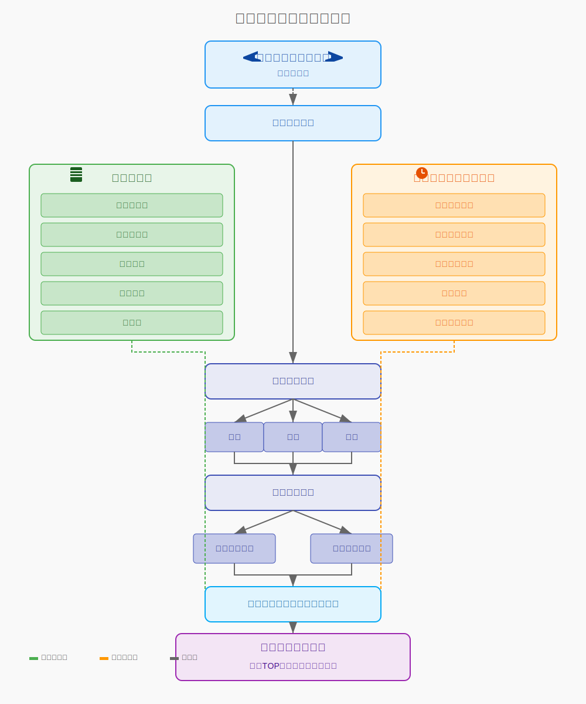
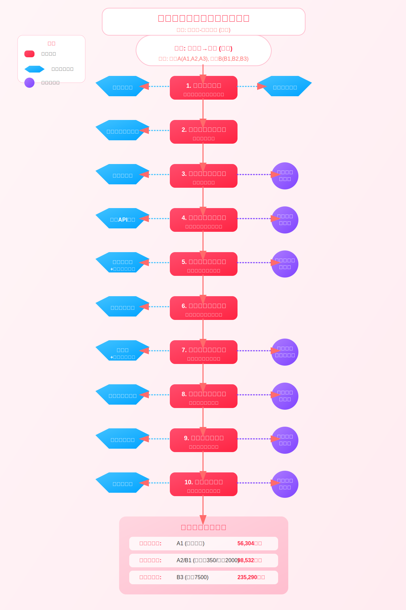

# 静态数据库
1. 机型数据库储备内容

机型分类与参数：储备六大类飞机（轻型、中型、大型、远程、旗舰、宽体）及各具体机型的基本参数，包括座位数、客舱尺寸、航程等技术指标
小时单价基准：每种机型的标准小时单价（从轻型3000-4000美金到旗舰机型15000美金不等）
最低飞行要求：各机型的最低飞行时间限制，特别是高端机型（如G700需至少5小时起算）
舒适度和配置：客舱配置、特殊设备、增值服务等用于客户选择参考

2. 基地数据库储备内容

全球基地城市清单：按区域划分的基地城市名单，包括：

中国区：北京、上海、深圳、广州、沈阳、常州、扬州、杭州、香港、台北
东南亚区：新加坡、曼谷、吉隆坡、雅加达、胡志明市等
北美欧洲区：所有主要城市均设为基地
其他地区：主要首都和首府城市


隐性基地信息：通过历史数据发现的非官方常见停场点
基地可用机型：每个基地常驻或可调度的机型清单
运营限制：各基地的时间限制、季节限制等特殊规则

3. 航线数据库储备内容

主流航线库：全球最常用的35万条航线的基础数据
标准飞行时间：各航线的标准飞行小时数
区域分类标记：国内航线、跨境航线、洲际航线的分类
特殊航线信息：超短途（如香港-澳门）、超远程航线的特殊处理规则
冗余系数配置：跨境航线1.2倍、非跨境航线1.1倍的时间修正系数

4. 航司数据库储备内容

航司基本资料：全球主要公务机运营商的基本信息
机队分布信息：各航司的机型分布和基地网络
特殊航司标记：如VistaJet、卡塔尔航空等适用特殊规则的航司
服务等级评定：航司服务质量评级和历史客户满意度
价格定位档次：航司的价格策略定位（经济型、标准型、高端型、豪华型）

5. 规则库储备内容

价格底线规则：不同区域的最低价格门槛

北美/欧洲：最低1.5小时（约6000美元）
亚洲（除日韩）：最低2小时（约8000-20000美元）
日韩：最低28000美元


调机费用规则：标准为载客费用的70%，特殊情况下的调整系数
跨洲际特殊规则：8小时以上长航线特殊计价方式
规则优先级：冲突时的处理顺序（跨洲豁免>机型强制门槛>区域最低价）
季节性调整参数：旺季溢价和淡季折扣系数


# 动态信息
## 1.需要实时查询的信息
1. 实时机位查询

飞机当前位置：实时跟踪各飞机所在位置（对计算调机费用至关重要）
飞机可用状态：是否在执行任务、维护或待命状态
短期排程信息：未来24-72小时内飞机的预定行程
查询频率：实时或5-15分钟/次

2. 特殊航线情况

临时航路限制：政治、军事因素导致的临时航路关闭
天气影响评估：风暴、雾霾等影响航线选择和飞行时间的天气因素
机场临时限制：机场维护、临时关闭或限流情况
查询频率：每1-2小时更新

3. 实时费率变动

燃油价格波动：航空燃油即时价格变化
机场费率变动：临时性的机场费用调整
汇率变化：跨国货币结算时的汇率波动
查询频率：每4-6小时更新

## 2定期查询的信息
4. 市场供需动态

热点行程分析：当前最受欢迎的航线和高需求时段
季节性需求预测：根据历史数据和当前趋势的季节性波动预测
特殊事件影响：重大会议、体育赛事、节假日等对特定航线的影响
查询频率：每日或每周更新

5. 航司动态信息

临时促销活动：航司的短期特惠或限时折扣
服务调整通知：航司服务内容或标准的变更
新增航线或机型：航司新引入的航线或机型信息
查询频率：每周更新

6. 政策法规变动

航空管制政策：各国空域管理政策变化
入境要求更新：目的地国家/地区的入境政策变动
特殊许可要求：需要提前申请的特殊飞行许可
查询频率：每周更新，重大变化实时关注

7. 客户特定信息

客户历史偏好：回头客的机型、服务偏好记录
特殊要求更新：客户最新的特殊需求或变更
查询频率：按需查询，交易前刷新


## 基础价格计算 

**出发地是基地情况：**
``` txt
总价 = 飞行小时单价 × 载客飞行时间 + 飞行小时单价 × 0.7 × 调机飞行时间

说明：
- 载客飞行时间 = 出发地到目的地的标准飞行时间 × 冗余系数
- 调机飞行时间 = 目的地返回基地的飞行时间（如需要）
- 冗余系数：跨境航线1.2，非跨境航线1.1
```

**出发地非基地情况：**
``` txt
总价 = 飞行小时单价 × 载客飞行时间 + 飞行小时单价 × 0.7 × (最近基地到出发地的飞行时间 + 目的地到基地的飞行时间)

说明：
- 最近基地指距离出发地飞行时间最短的基地城市
```

**往返价格计算**

**出发地是基地情况：**
``` txt
Copy总价 = 飞行小时单价 × 来回载客飞行时间

说明：
- 来回载客飞行时间 = (出发地到目的地的飞行时间 + 目的地到出发地的飞行时间) × 冗余系数
```

出发地非基地情况：
``` txt
Copy总价 = 飞行小时单价 × 来回载客飞行时间 + 飞行小时单价 × 0.7 × 最近基地城市调机到出发地的时间

说明：
- 仅计算从基地到出发地的单程调机（返程回到原出发地，不需要再计算回基地的调机）
```

**多程价格计算** 

**出发地是基地情况：**
``` txt
总价 = 飞行小时单价 × 所有航段总的载客飞行时间 + 飞行小时单价 × 0.7 × 调机飞行时间

说明：
- 所有航段总的载客飞行时间 = 所有航段飞行时间之和 × 各段对应冗余系数
- 调机飞行时间 = 如果最终目的地不是出发地，则需添加从最终目的地回出发地的调机时间

```

**出发地非基地情况：**
``` txt
总价 = 飞行小时单价 × 所有航段总的载客飞行时间 + 飞行小时单价 × 0.7 × (最近基地调机到出发地的时间 + 最终目的地调机回基地的时间)
```

## 特殊规则库

### 价格底线规则

``` txt
1. 北美和欧洲地区：
   - 最低飞行时间：1.5小时
   - 最低价格门槛：约6000美金
   - 适用原因：市场发达，飞机流通性高

2. 亚洲区域内（除日韩）：
   - 最低飞行时间：2小时
   - 最低价格门槛：
     - 东南亚区域内：约8000美金（如泰国境内、新马印等）
     - 中国及港澳台：约20000美金
   - 适用原因：机场费普遍高，且多为喷气式飞机

3. 日韩区域：
   - 最低价格门槛：28000美金
   - 适用原因：本土可用飞机少，常需从中国调机
   - 实现方式：不将日韩设为基地城市

4. 高端机型特殊规则：
   - 适用机型：G700，环球7500，猎鹰8X等旗舰机型
   - 最低飞行时间：5小时（无论行程长短）
   - 适用原因：高端机型不接受短程任务
```

### 跨州规则 

``` txt 
1. 适用条件：
   - 航司为VistaJet或卡塔尔航空
   - 使用远程机型（环球6000、G650等）
   - 飞行时间超过8小时的洲际行程
   
2. 规则内容：
   - 免除所有调机费用
   - 仅按载客时间计算价格
   - 计算公式：小时单价 × 实际飞行时间
   
3. 参考价格：
   - 卡塔尔G650：16500美金/小时
   - VistaJet环球系列：15000-16000美金/小时

```

 多基地优化规则
1. 适用条件：
   - 飞机同时归属多个基地城市

2. 规则内容：
   - 系统自动选择距离出发地最近的可用基地
   - 计算公式中使用最短调机时间
   
3. 示例：
   - 某飞机基地为北京/上海
   - 执行广州→成都单程任务
   - 调机路径 = min(北京→广州, 上海→广州)
4. 动态调机豁免规则
1. 适用条件：
   - 飞行路径形成基地间的闭环
   
2. 规则内容：
   - 免除终点调机费用
   - 视为全基地计算方式
   
3. 示例：
   - 行程为：北京→上海→广州→北京
   - 北京为基地，全程按载客计费无调机
5. 冗余系数规则
. 跨境航线：实际飞行时间 × 1.2
   - 适用于国际航线
   - 考虑边检、额外燃油等因素

2. 非跨境航线：实际飞行时间 × 1.1
   - 适用于国内航线
   - 考虑空域拥堵等因素
6. 规则冲突处理优先级
Copy优先级从高到低排序：
1. 跨洲豁免规则
2. 机型强制门槛规则
3. 区域最低价规则

决策逻辑：
- 当多个规则同时适用时，按优先级顺序应用
- 高优先级规则可覆盖低优先级规则


# 示例：北京到新加坡




私人飞机包机预估系统：完整工作流程
基于新加坡到北京的行程示例，推荐航司A（机型A1,A2,A3）和航司B（机型B1,B2,B3），下面是完整的工作流程描述：
工作流节点详解

### 节点1：输入处理节点
任务：接收并验证初始输入信息

固定工具调用：

航线数据库查询：验证新加坡-北京航线基础信息
机场代码转换工具：将城市名转换为ICAO/IATA机场代码


执行操作：

确认航线有效性
标记为跨境国际航线
记录基本航线信息（距离、标准飞行时间等）


输出：验证后的行程基础信息

### 节点2：行程类型判断节点
任务：确定行程类型（单程、往返或多程）

固定工具调用：

行程类型判断引擎：分析输入确定行程类型


执行操作：

默认设置为单程（除非用户指定）
记录行程类型标记


输出：行程类型（本例中确定为单程）和相应计算模板

### 节点3：基地情况判断节点
任务：检查新加坡和北京是否为推荐航司的基地城市

固定工具调用：

基地数据库查询：获取航司A和航司B的基地信息
基地比对工具：比较行程城市与航司基地


执行操作：

查询新加坡是否为航司A/B的基地
查询北京是否为航司A/B的基地
记录各航司的基地情况


动态智能介入：

智能体分析隐性基地数据，提供补充基地判断
评估基地可信度，若航司A在该地区频繁运营但未正式列为基地，智能体可辅助判断


输出：各航司针对该航线的基地情况矩阵

### 节点4：飞机位置与可用性查询节点
任务：确定推荐机型的当前位置和可用性

固定工具调用：

飞机位置API查询：获取机型A1-A3和B1-B3的当前位置


动态智能介入：

位置追踪智能体：实时查询各推荐机型的当前位置
可用性评估智能体：检查近期排程确认可用性


执行操作：

记录各机型当前位置
标记实际可用机型
计算各机型从当前位置到出发地的调机时间


输出：飞机位置数据和调机时间初步估计

### 节点5：飞行时间计算节点
任务：计算载客和调机飞行时间

固定工具调用：

航线时间计算器：计算新加坡-北京标准飞行时间
冗余系数应用工具：应用国际航线1.2倍冗余系数


动态智能介入：

航路智能体：查询当前航路状况和临时限制
天气影响评估智能体：分析气象对飞行时间的影响


执行操作：

计算载客时间（新加坡-北京）：约6小时×1.2=7.2小时
计算各机型的调机时间：

如飞机在新加坡：无需调机到出发地
如飞机在其他地点：计算到新加坡的调机时间
如北京非基地：计算北京到最近基地的调机时间


输出：完整的飞行时间计算结果（载客和调机）

### 节点6：基础价格计算节点
任务：应用基础价格计算公式

固定工具调用：

机型价格数据库：获取各机型小时单价
价格计算引擎：应用单程价格公式


执行操作：

获取各机型小时单价：

A1（假设为轻型）：4000美金/小时
A2（假设为中型）：7000美金/小时
A3（假设为大型）：9000美金/小时
B1（假设为中型）：7000美金/小时
B2（假设为远程）：12000美金/小时
B3（假设为旗舰）：15000美金/小时


应用单程公式计算基础价格：

出发地是基地：单价×载客时间+单价×0.7×调机返回时间
出发地非基地：单价×载客时间+单价×0.7×(调机前往+调机返回)


输出：各机型的基础价格计算结果

### 节点7：特殊规则应用节点
任务：检查并应用适用的特殊规则

固定工具调用：

规则库查询：检索适用的特殊规则
规则应用引擎：按优先级应用规则


动态智能介入：

规则判断智能体：处理规则适用的边界情况
冲突解决智能体：当多规则适用时进行优先级判断


执行操作：

检查跨洲际规则（新加坡-北京为洲内，不适用）
检查高端机型规则（如B3为旗舰机型，适用5小时最低限制）
检查区域最低价规则（亚洲区域跨国，适用）
解决规则冲突（如有）


输出：应用特殊规则后的修正价格

### 节点8：动态因素调整节点
任务：应用实时市场因素进行最终调整

固定工具调用：

季节性调整计算器：应用季节性价格变动


动态智能介入：

市场分析智能体：分析当前供需状况
价格监控智能体：获取燃油价格和汇率波动
航司促销智能体：检查临时优惠政策


执行操作：

应用燃油价格波动调整
应用季节性因素（如当前为旅游旺季）
应用特殊事件影响（如有重大会议在目的地）


输出：完全调整后的最终预估价格

### 节点9：多方案比较节点
任务：比较所有机型方案，进行归类排序

固定工具调用：

方案比较引擎：对所有价格方案进行比较
方案分类工具：按价格和舒适度分类


动态智能介入：

优化推荐智能体：结合历史客户偏好进行个性化排序


执行操作：

对所有机型方案按价格从低到高排序
计算价格差异百分比
标记最佳性价比选项


输出：排序后的方案列表

### 节点10：结果生成节点
任务：生成最终预估价格和推荐方案报告

固定工具调用：

报告生成器：组织所有信息生成最终报告


动态智能介入：

内容优化智能体：根据客户特征调整展示方式


执行操作：

生成价格预估明细（基础费用、调机费用、附加费用等）
添加舒适度和服务水平比较
提供各方案的时间效益分析


输出：完整的预估价格报告和TOP推荐方案


-------
``` txt
预估价逻辑
要做预估价逻辑，最重要的两个关键因素是飞机机型和飞机基地。
	飞机机型决定飞机小时单价
首先要对不同飞机机型的飞行小时单价进行划分，那么在输出不同机型方案的时候，才能有相应的价格。
（需要注意的是，我们讨论的是一个预估价，不是精准报价。其次我们是broker视角，不是航司视角，所以通常我们考虑飞机小时单价指的是打包价，我们不需要去研究价格的精细化组成。也就是说我们只考虑包含了基础飞行费、机组成本、燃油、飞机维修成本、机场费等所有变动成本和固定成本后的一个打包费，称之为飞机小时单价。）
飞机机型按照如下几个维度划分，以及对应相应级别的小时单价：
1.	轻型公务机：这类飞机包括赛斯纳野马、空中国王350，赛斯纳奖状君主、飞鸿300、皮拉图斯PC-12\24,比亚乔Elite一般来说座位数在6-9座，小时单价3000-4000美金。
2.	中型公务机:包括庞巴迪挑战者350、604、605、湾流G100、150、200，达索猎鹰2000、豪克HK850，小时单价7000美金。
3.	大型公务机：庞巴迪挑战者850、巴航工业莱格赛650、湾流450、达索猎鹰7x。小时单价9000美金。
4.	远程公务机：庞巴迪环球5000、6000、湾流G550、650、700，小时单价12000美金。
5.	最新旗舰机型：庞巴迪环球7500、湾流G700、达索猎鹰8X，小时单价15000美金。
6.	宽体机：波音737、BBJ和空客318、319 ，小时单价15000美金。
备注：
1、以上单价都设计的偏低，主要是为了不让预估价格比市场价格高而丢失客户
2、以上机型只是举例，还不全，需要同学们自己去把所有可能出现的机型纳入进去，尤其是第1、2类。
3、直升机需要另叙述

	单程、来回、多程的基础价格测算公司
上述了解了小时单价后，我们就可以测算一个包机最基础的算价逻辑：
1、来回程：飞行小时单价*来回载客飞行时间
2、单程：如果客户只要单程，对于航司来说，飞机通常还需要调机回，航司对于调机部分的收费，是载客部分的7-8折，所以如果要测算单程价格，逻辑是： 飞行小时单价*载客飞行时间+飞行小时单价*0.7*调机飞行时间。
3、多程：系统要对出发地和目的地进行判断，如果最终目的地不是出发地，那么还需要计算一段飞回出发地的调机。所以逻辑是： 飞行小时单价*所有载客航段飞行时间+飞行小时单价*0.7*调机飞行时间。
（我们把这个逻辑叫做出发地在基地公司的预估价逻辑）
	飞机基地影响飞机总价
通过上述分析，了解了单价和总价的测算后，提醒大家以上前提是基于客户的出发地就有飞机的前提下。比如上海-香港单程，计算费用就是载客2小时*小时单价+调机2小时*0.7.   但是假如客户出发城市是成都呢？成都不是任何一家公司的基地，成都出发的行程需要从上海、北京、深圳调机。那么成都这类不是基地公司的城市，他的预估价格就需要用另外一套逻辑。
1、来回程：飞行小时单价*来回载客飞行时间+飞行小时单价*0.7*最近基地城市调机到出发地的时间
2、单程：飞行小时单价*载客飞行时间+飞行小时单价*0.7*（飞机从基地调机前往出发地+从目的地调机回基地飞行时间）。
3、多程：系统要对出发地和目的地进行判断，如果最终目的地不是出发地，那么还需要计算一段飞回出发地的调机。所以逻辑是： 飞行小时单价*所有航段总的载客飞行时间+飞行小时单价*0.7*（飞机从基地调机前往出发地+从目的地调机回基地飞行时间）。

因为在实际业务操作中，对于一个具体特定的行程来说，因为飞机基地的原因，（或者也可以说因为飞机停放的位置的原因），并非小型的飞机的包机价格就一定比大型飞机的便宜。举例来说，客户需要一个越南河内飞新加坡的来回程。越南河内有一家航司有莱格赛650飞机，泰国曼谷有家航司有空中国王350. 那么莱格赛650的价格就一定要比国王350的价格便宜。
所以飞机基地的概念非常重要，相对于飞机机型小时单价而言，基地影响价格更大。所以我们一定要对全球城市是否有飞机这个数据进行研究，对于有飞机的城市，可以打标签认定为基地城市。我能给到大家的建议是按照公务机产业发达成都做到如下情况的划分：
1.	中国：因为比较熟悉，所以可以给的细一些，有飞机长期停场的城市有：北京、上海、深圳、广州、沈阳、常州、扬州、杭州。中国的海外城市有飞机的有香港、台北。但是澳门是没有的
2.	东南亚：新加坡、泰国曼谷、吉隆坡、雅加达、胡志明、菲律宾、老挝有飞机停场。其他城市没有。包括日韩，都可以设定为没有飞机，需要就近调机的。
3.	北美、欧洲是最大发的地区，大家可以设定所有城市都有飞机基地。因为第一他们飞机保有量特别多，第二他们流动性很强，他们的飞机可以飞到哪算哪。
4.	中东，西亚、南美、南非，大家可以设定他们的首都和首府（就类似我们的省会城市）有飞机。其他地方没有。
	需要设置价格底线
1.	飞行时间很短的行程。有时候客户会查询很近的两个城市之间的行程价格，比如香港-澳门，上海-杭州。如果仅根据实际飞行时间，会出现低得很离谱的价格。但是实践中飞机往往都会有最低任务金额。这个最低限度根据全球各地发展水平不同有区别：
①　北美和欧洲两个包机行业发达国家，因为飞机流通性比较高，业务比较高频，所以可以设置一个最低1.5小时的起算门槛。（结合机型来看，因为会有很多性价比很高的螺旋桨飞机，所以6000美金左右的最低门槛高即可）
②　亚洲区域内，泰国境内、印尼和新加坡马来三个国家之间的区内，都有类似国王350，比亚乔、皮拉图思这些螺旋桨飞机，设置相对最低2小时的门槛，结合小时单价4000美金左右的价格，最低价格可以在8000美金左右。
③　亚洲区域内，首先是中国，类似港澳，上海杭州这种很近的，需要设置一个最低2小时的起算门槛。（结合机型，因为几乎没有很便宜的螺旋桨飞机，且机场费普遍比较高，所以他们的行程最低价格基本上到2万美金以上）。
④　亚洲区域内，日本和韩国非常特殊，因为本土可使用的飞机非常少，所以即使是东京-札幌、首尔-济州这样很近的行程，往往也需要从中国调机去飞。所以日韩境内短途行程的最低价要设置到28000美金左右。（但是这个逻辑就不用单独设置了，大家只要在设置飞机基地的时候不要设置日本为基地城市即可）
2.	机型特别高端的行程。G700，global 7500，猎鹰8X，这些都是最顶级的飞机，小行程任务都不接，这些机型不管什么行程，最好都设置最低价5小时。
	跨洲际飞行的行程需要按照无调机计算
由于在国际上存在VJ和卡塔尔这两家公司，他们的运力分布全球，他们的业务来源也很广以便于他们可以实行飞机飞到哪算哪的政策，他们的远程飞机庞巴迪环球6000和湾流G650在做洲际大行程的时候是可以按照载客收费不收调机的。如果我们不加上这个逻辑，那么我们的预估价在提供洲际行程的时候就会毫无优势。 通常卡塔尔的650飞机报价是1.65万美金/小时，VJ的环球价格也在1.5-1.6万每小时。大家对于大于8个小时的行程，可以按照单算载客，不要按照前述的基地概念去设置逻辑。


私⼈⻜机包机价格预估⽅案
Hermans
今天修改
概述
本⽅案利⽤ AI 多智能体架构，通过整合静态数据和动态信息，实现⾃主学习、实时修正和浮动计算。利⽤经理智能体进⾏协调调度和冲突处理，各智能体分别负责不同规则的⾃主决策，有望超越传统基于规则的价格计算公式。为提升响应速度，需提前预估并存储全球前 35 万条包机航线的预估价格，在调⽤时先展示预存价格，其余报价实时计算逐步展示。同时，通过学习⻜机历史⾏程判断隐性基地，并利⽤联⽹信息确定同机型不同航司的浮动费率，未来更可利⽤真实报价进⾏强化学习优化价格策略。
关键词：多智能体、强化学习、动态修正、浮动费率
核⼼架构
数据层细分
静态数据：包含机型参数、航司基地、⼩时单价等基础数据。
推荐系统输出：预先计算全球前 35 万条主流航线的推荐航司和推荐⻜机。
隐性基地学习：通过⻜机历史⾏程数据，挖掘⾮官⽅的隐性基地信息。
规则库：包含调机豁免、价格底线、跨洲逻辑等规则。
智能体层细分
协调层细分
经理智能体：
优先调⽤预计算库，快速展示 TOP ⽅案，并⾏触发实时计算以补充结果。
仲裁规则冲突，规则优先级为：跨洲豁免 > 机型强制⻔槛 > 区域最低价。
⽀持强化学习接⼝，未来通过真实报价数据优化调机系数、冗余系数等参数。
优势和关键技术
核⼼优势
在包机航线及⻜机推荐业务场景中，传统规则系统和AI多智能体架构有着明显的差异。传统规则系统主要依赖⼈⼯维护和更新，难以适应快速变化的业务需求；⽽AI多智能体架构不仅具备更强的⾃学习能⼒，还能动态调整定价和策略，极⼤提升效率与准确度。以下将从拓展性、隐性基地识别、价格策略优化、响应速度四个关键维度，对⽐两种系统的差异，并结合关键技术实现进⾏阐述。
从表格中可⻅，AI多智能体架构在可扩展性、准确性、灵活性以及响应速度⽅⾯都有显著优势，能够在复杂且实时性要求较⾼的场景下表现出更⾼的效率。
关键技术实现
数据存储与离线预计算
预存全球包机航线数据：为了保证⾸屏结果<200ms，需要提前离线计算并存储全球包机航线（全球前35万条）的推荐⽅案，包括航司、机型以及预估价格。
预估价快速展示：在⽤户查询时，系统会先从离线存储中快速调取预估价格并进⾏展示，后续再通过实时计算逐步刷新和完美报价。
隐性基地识别
数据不完整问题：尽管数据库中提供了每架⻜机的官⽅基地信息，但可能不全或存在时效性问题。
历史轨迹学习：AI多智能体可根据⻜机的历史⾏程数据进⾏模式挖掘，⾃动识别潜在的隐性基地。若某个地点的⻜⾏频次和停留时间达到⼀定阈值（如0.5），则可认定为潜在基地。
浮动费率与动态定价
多因素实时调控：在传统规则系统下，价格多为固定或只能做少量⼿动调整。AI多智能体则可结合服务⽔平、市场供需、历史信⽤等信息，通过强化学习或模型推断，对不同航司和机型进⾏实时的费率浮动。
收益与体验兼顾：动态调整价格不仅有利于航司收益最⼤化，也能通过竞争机制提升服务质量，保证⽤户获得更合理的价。
冲突消解树（经理智能体决策树）
规则优先级固化：在传统系统中，规则冲突往往需要⼈⼯判定和处理；AI多智能体架构通过将规则的优先级和适⽤范围以决策树的形式固化，减少⼈⼯⼲预。
⾃主决策：当不同规则或场景发⽣冲突时，经理智能体可根据事先设定的优先级、条件和业务逻辑⾃动完成决策，缩短处理时间并降低出错率。
综合优势与展望
⾼扩展性：AI多智能体架构通过⾃学习与协同演绎，能快速适应业务规则的变动，降低⼈⼯维护成本。
精准识别隐性基地：利⽤历史数据挖掘和阈值判断机制，克服官⽅数据库不完善的局限，提升运⼒调度的合理性。
灵活定价与优化：强化学习或模型推断的引⼊，让定价更加灵活，实时响应市场需求和服务⽔平差异。
超快响应速度：预计算与实时计算结合，⽤户⾸屏查询结果<200ms，⼤幅提升⽤户体验与满意度。
规则冲突⾃动消解：通过冲突消解树固化业务逻辑，减少⼈⼯介⼊和错误率，实现稳定且⾼效的业务运营。
在包机航线与⻜机推荐业务中，AI多智能体架构将传统规则系统的⼈⼯⼲预与固定逻辑升级为可⾃适应、⾃学习的智能决策⽅式，既提升了系统的灵活性和准确度，⼜降低了对⼈⼯维护的依赖。随着技术的不断演进，AI多智能体在定价优化、资源调度、隐性基地识别等⽅⾯的表现将更加优异，为⾏业带来更⼤价值。
扩展性与未来优化
强化学习闭环
输⼊：⽤户点击/成交数据、市场供需变化。
输出：优化调机系数阈值、冗余系数、价格底线策略。
全局异常监控
⾃动标记偏离市场价 10% 以上的报价，并触发⼈⼯复核或规则迭代。
核⼼准备⼯作
数据资源准备
静态信息：
⻜机基地信息（官⽅基地、隐性基地识别需通过历史⾏程数据挖掘）
各细分机型的基础⼩时费率
调机系数（如0.7）等规则参数
动态数据接⼝：
推荐系统接⼝（提供各航线的推荐航司和⻜机）
⻜⾏⼩时计算接⼝
主流航线数据：
有公务机⻜机历史⻜⾏记录的全球航线
技术架构设计
多智能体框架搭建
强化学习模型搭建
规则库与冲突消解机制
明确规则优先级（如跨洲豁免 > 机型强制⻔槛 > 区域最低价）。
构建冲突消解决策树（基于业务逻辑的⾃动化仲裁流程）。
业务规则（模拟）
⻜机机型与⼩时单价规则
基础价格测算逻辑
分场景的包机总价计算公式汇总表，包含 单程、往返、多程 在不同基地组合下的计算规则：
⻜⾏⼩时单价 = P
调机⼩时单价 = 0.7P
单程场景
往返场景
多程场景（N个航段）
关键逻辑说明
多基地优化：
若⻜机归属多个基地，优先选择 出发地/⽬的地最近可⽤基地
示例：某⻜机基地为北京/上海，执⾏「⼴州→成都」单程时：
调机路径 = min(北京→⼴州, 上海→⼴州) # 取⻜⾏时间更短的路径
动态调机豁免：
当⻜⾏路径形成 基地间闭环 时，免除终点调机费⽤ （例：北京→上海→⼴州→北京，按全基地计算）
价格底线规则：
短途⾏程最低⻔槛：
北美/欧洲：最低 1.5⼩时（约6000美元）。
亚洲（除⽇韩）：最低 2⼩时（约8000-20000美元）。
⽇韩：因需从中国调机，最低 28000美元（逻辑通过不设⽇韩基地实现）。
⾼端机型强制⻔槛：
G700、环球7500等顶级机型：最低 5⼩时（⽆论⾏程⻓短）。
跨洲际⻜⾏特殊规则：
豁免调机费⽤：
适⽤场景：洲际⻜⾏（如跨⼤⻄洋、亚欧航线）。
适⽤航司：VJ、卡塔尔航空（使⽤环球6000、G650等远程机型）。
常⽤价格：通常卡塔尔的G650⻜机报价是1.65万美元/⼩时，VJ的GL价格也在1.5-1.6万美元/⼩时
逻辑：直接按载客时间计算价格，⽆需调机费⽤。公式：⼩时单价 × 实际⻜⾏时间 。
其他补充规则：
调机系数：统⼀按⼩时单价的 70% 计算。
冗余系数：
跨境航线按⻜⾏时间 × 1.2（冗余修正）。
⾮跨境航线按⻜⾏时间 × 1.1。
特殊航线修正：需额外调整⻜⾏时间（如跨北极航线）。


```